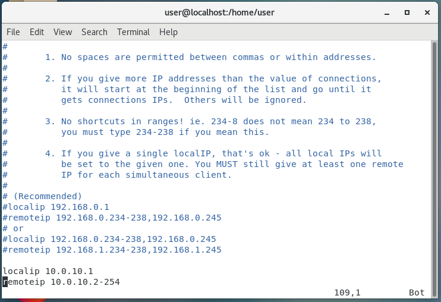

# 安裝VPN PPTP，並互連

切到管理員模式

    su

安裝EPEL套件，此為第三方套件

    yum install epel-release -y
    tum clean all -y        /清除快取

安裝PPTP

    yum install ppp pptp -y

之後使用以下指令配置

    vim /etc/pptpd.conf

並新增以下兩行

    localip 10.0.10.1
    remoteip 10.0.10.2-254
完成如下

之後使用以下指令更改`ms-dns`

    vim /etc/ppp/options.pptpd
    ms-dns 8.8.8.8
    ms-dns 8.8.4.4

設置帳號密碼

    vim /etc/ppp/chap-secrets

    內容配置
    # Secrets for authentication using CHAP
    # client        server  secret                  IP addresses
    使用者名稱 pptpd 密碼 連線IP(也可以用*號)

啟用pptpd

    systemctl start pptpd
    systemctl stauts pptpd

檢查連線是否有成功，成功會多出以下圖片的這行

    ifconfig

## 設置可對外連線

* 目前的VPN配置完後，會是一個死循環，若要對外連線目前我的作法是，新增一張實體的無線網卡。

並使用以下指令查看路由狀態。

    ip route show

若無線網卡的路由不在第一位，請使用以下指令

    ip route del default via [網卡ip]

使用以下指令將內網封包發出並進行轉發

    iptables -A FORWARD -o wls* -s 10.0.10.0/24 -m conntrack --ctstate NEW -j ACCEPT
    iptables -A FORWARD -m conntrack --ctstate ESTABLISHED,RELATED -j ACCEPR
    iptables -t nat -A POSTROUTING -o wls* -s 10.0.10.0/24 -j MASQUERADE
    echo 1 > /proc/sys/net/ipv4/ip_forward
    
設完之後應該是要可以對外連線的。

---

# 改SSH埠號並加入白名單

先下載semanage

    yum -y install policycoreutils-python

改埠號指令

    vim /etc/ssh/sshd_config
    將裡頭`#port 22`改為`port 2222`

並將埠號和ssh增加到白名單

    firewall-cmd --permanent --zone=public --add-service=ssh
    firewall-cmd --permanent --zone=public --add-port=2222/tcp
    firewall-cmd --reload
    firewall-cmd --zone=public --list-all --permanent       /查詢是否有加入成功

重啟ssh

    systemctl restart sshd
    systemctl status sshd

若不想讓對外連線的埠號被看到可以使用以下指令隱藏

    firewall-cmd --add-forward-port=port=1234:proto=tcp:toport=2222